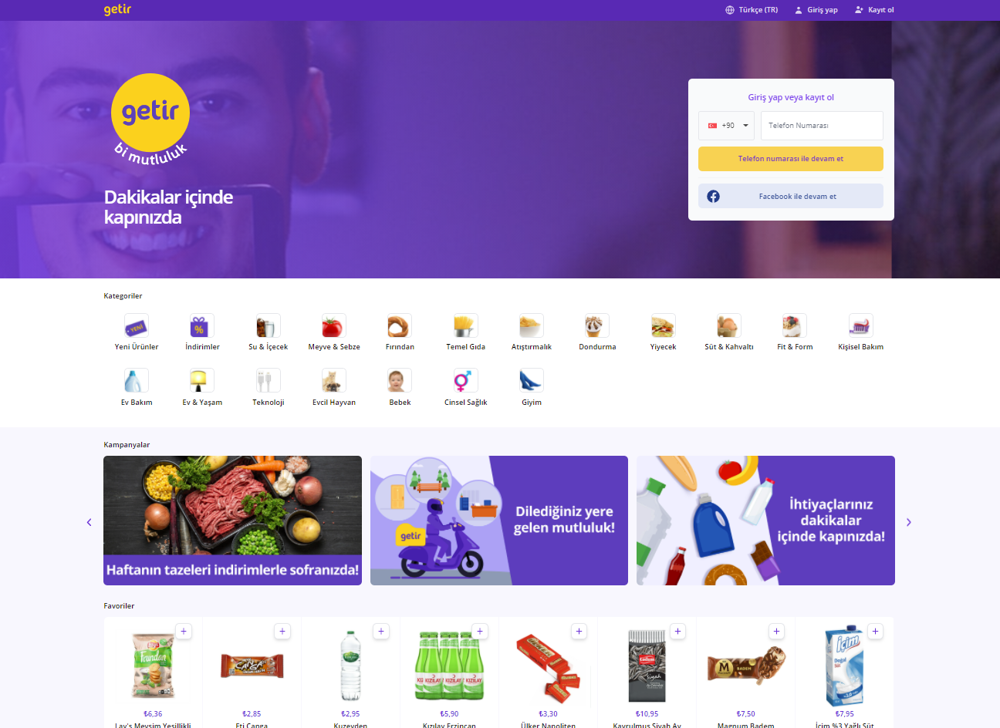

# React && Tailwind Getir Clone

Bu projede react ve tailwind css kullanarak getir sitesinin giriş sayfasını
kodladım.

<p align="center">
  
<p>

## Kullanılan Teknolojiler

React, TailwindCSS, React Hooks

## Bilgisayarınızda Çalıştırın

Projeyi klonlayın

```bash
  git clone https://link-to-project
```

Proje dizinine gidin

```bash
  cd my-project
```

Gerekli paketleri yükleyin

```bash
  npm install
```

Sunucuyu çalıştırın

```bash
  npm run start
```
## Çıkarılan Dersler

- Bu projeyi kodlarken tailwindcss'in bizlere sunduğu eşsiz esnekliğin 
farkına varmış oldum.
- Responsive design konusunda kendimi bir adım daha ileri attığımı ifade edebilirim.